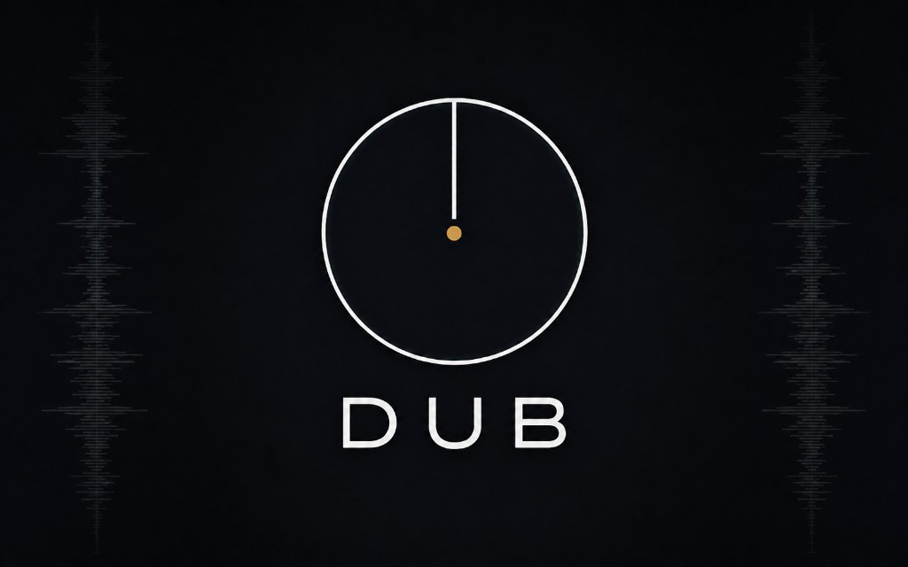

<div align="center">

# Dub

**A timecode-vinyl DJ application for scratch DJs and vinyl enthusiasts.**

*Mac-first. Rust-cored. GPLv3.*

[](https://github.com/kLOsk/dub/actions/workflows/ci.yml)
[](LICENSE)
[](https://www.rust-lang.org)
[](#status)
[](#milestone-progress)



</div>

> Dub is the spiritual successor to Serato Scratch Live for the urban music scene
> (hip hop, reggae, dnb, dubstep, scratch). Two decks, external mixer, real
> records **through** the software, smart utility FX, fast sample throws.

This is **pre-alpha software**. There is no release. There is `main`.

---

## What's interesting about this project

- **Rust on the audio thread.** The engine runs in a CoreAudio HAL IOProc with
  zero allocations, zero locks, and zero syscalls. Verified in CI by the
  [`rt-audit`](tools/rt-audit) binary, which renders 100k blocks under
  [`assert_no_alloc`](https://crates.io/crates/assert_no_alloc) before any merge.
- **Clean-room timecode.** [`dub-timecode`](crates/dub-timecode) decodes Serato
  CV02 in relative mode — analytic-signal demod, signed rate, confidence
  estimate, all alloc-free. ([Architecture notes.](docs/spec/ARCHITECTURE.md))
- **Lift policy hardened on real hardware.** The `LiftPolicy` state machine
  combines a three-layer defense — RMS amplitude gate, two-edge confidence
  hysteresis, sticky-block window — driven by SL3 + Serato CV02 testing.
  Each pathology has a dedicated regression test.
- **TUI inspector.** [`dub scope`](crates/dub-cli/src/scope.rs) is a ratatui
  Lissajous + gauges + live thresholds, sharing the same `LiftPolicy` as
  playback so calibration transfers 1:1.
- **No mouse on the audio path, ever.** UI = external mixer + controllers + the
  user's hands on real records. The mouse is for browsing tracks, period.

## Quickstart

Mac with Rust stable, an audio interface, and (optionally) a Serato CV02
control vinyl.

```bash
# Build everything in release mode.
make ci

# Smoke-test the engine.
./target/release/dub smoke

# Play a file through CoreAudio at the device's native sample rate.
./target/release/dub play --realtime path/to/track.mp3

# Live timecode → deck (M5.3 / M6). One deck, Serato CV02 on SL3 ch 3+4.
# Auto-runs a fresh ~3.5 s calibration on startup (M5.4.3 / M5.4.6);
# audio output is live immediately, deck attaches the moment the carrier locks.
./target/release/dub timecode-deck path/to/track.mp3 --input-channels 3,4

# Two-deck timecode (M5.6 + M5.5.2). Single SL3 demuxed in the IOProc; each
# deck gets its own input ring, its own calibrator, its own output channel pair.
# The device-profile flag picks up the SL3's deck-A → ch 3+4, deck-B → ch 5+6
# routing automatically (also auto-detected if the device name matches).
./target/release/dub timecode-deck a.mp3 b.mp3 \
    --input-channels 3,4 --deck-b-input-channels 5,6 \
    --device-profile "SL 3"

# Traktor MK1 or MK2 instead of Serato (M6). Bare `traktor` is rejected as
# ambiguous — pick the generation, getting it wrong = silent 25 % speed error.
./target/release/dub timecode-deck a.mp3 --input-channels 3,4 --format traktor-mk2

# Thru mode — real (non-timecode) record routed through the engine (M7).
# Constant ~2.7 ms one-way latency, software-always-on so M8 BPM + M9 waveform
# + M15+ FX can hook in. One mode, no flags — there is no hardware-bypass mode.
./target/release/dub thru --input-channels 3,4 --device-profile "SL 3"

# TUI inspector for tuning your rig against the live timecode signal
# (M5.4.1). Same LiftPolicy as `timecode-deck`, so what you see here is what
# you'd hear during playback.
./target/release/dub scope --input-channels 3,4

# Manual one-shot per-rig calibration (M5.4.2 / M5.4.3 / M5.4.4).
# Default is single-phase carrier-only (~3.5 s). JSON is a diagnostic
# artifact only — `timecode-deck` doesn't read it back; every startup
# recalibrates fresh against whatever rig is in front of you (M5.4.6).
# Stored at ~/.dub/calibration/<device>_deck_<idx>_<format>.json.
./target/release/dub calibrate --input-channels 3,4 --deck 0

# Inspect output offline — `dub analyze` runs the M3.5 click detector
# over any WAV (peak / RMS / DC / clipping / max per-sample delta).
./target/release/dub analyze path/to/captured.wav

# Bootstrap the macOS app (M0.5 / M10). One-time: `brew install xcodegen`.
# Generates DubCore.xcframework + Swift UniFFI bindings + Dub.xcodeproj.
./scripts/bootstrap.sh
make app                              # or: open apple/Dub.xcodeproj and ⌘R
open apple/build/Build/Products/Debug/Dub.app
#                            Two-deck performance surface with library browser,
#                            Metal waveforms, launch splash, app icon, and
#                            About sheet (DUB wordmark or Dub → About Dub).
```

`dub scope` keys: `q`/`Esc` quit, `c` clear lissajous, `↑/↓` engage threshold,
`PgUp/PgDn` disengage, `←/→` amplitude, hold `Shift` for 10× steps.

## Milestone progress

Roadmap and forward-looking milestones live in [`docs/spec/PRD.md` §12](docs/spec/PRD.md#12-milestones);
detailed design history for everything shipped lives in
[`docs/history/SHIPPED.md`](docs/history/SHIPPED.md) (load it by anchor, not whole-file). Beat-grid
history specifically lives in [`docs/spec/PRD-BEATS.md`](docs/spec/PRD-BEATS.md), the binding
sub-spec for tempo / downbeat / tap-to-grid / waveform overlay.

| Range | Status | Scope | History |
|---|---|---|---|
| **M0 → M4** | ✅ shipped | Scaffold, CI, RT-safety harness + soak/fuzz, first sound, lock-free transport command channel, format coverage (mp3 / flac / m4a / aiff / aac / alac) + hot `Arc<Track>` loading, de-click envelope, `dub analyze` offline click detector, two decks + debug mixer. | [`SHIPPED.md`](docs/history/SHIPPED.md) |
| **M5.1 → M5.6** | ✅ shipped | Clean-room Serato CV02 decoder → live timecode-to-deck with 3-layer `LiftPolicy` (the point Dub becomes a DJ app) → `dub scope` + `dub calibrate` → fast single-phase per-deck calibration → late-binding DJ takeover → external-mixer 4-channel routing → two-deck timecode. | [`SHIPPED.md`](docs/history/SHIPPED.md) |
| **M6 + M7** | ✅ shipped | Traktor MK1 (2 kHz) + MK2 (2.5 kHz) through the same format-agnostic decoder; **Thru Mode** — per-deck always-on software passthrough at constant ~2.7 ms one-way latency, FX-ready, with the `dub thru` CLI. | [`SHIPPED.md`](docs/history/SHIPPED.md) |
| **M7.5 → M8.1** | ✅ shipped | Pure-Rust BPM engine (`dub-bpm`: spectral-flux + harmonic-summed autocorrelation; aubio parked); auto-BPM streaming driver on Thru (`BpmStream`, alloc-free mono tee); log-band ODF + windowed-energy octave fix + `BpmRange` escape hatch. | [`SHIPPED.md`](docs/history/SHIPPED.md) |
| **M9 → M10.8** | ✅ shipped | Live waveform capture (`dub-peaks`); `dub-spectral` extraction + 8-band peak capture; Apple shell (M0.5); `DubEngine` UniFFI surface; Metal multi-colour waveform; palette presets + honest silence/clipping; Performance/Prep shell; mouse transport + Panic Play; Phase-Drift Trail; Serato-parity waveform baseline freeze (§9.6.0 guardrail). | [`SHIPPED.md`](docs/history/SHIPPED.md) |
| **M11a → M11d.4** | ✅ shipped | SQLite library (path-by-volume-UUID); pure-Rust Chromaprint dedupe; filesystem importer + filename parser; library browser shell, Recently Played, sortable columns, per-row indicators; background missing-files scanner + Relocate panel. | [`SHIPPED.md`](docs/history/SHIPPED.md) |
| **M11c.1 → M11c.4** | ✅ shipped | Lazy auto-beatgrid + analysis lifecycle; Camelot key detection (`track_keys`, schema v3); BPM octave fixes (perceptual prior, reggae/hip-hop double-time rejection, genre-aware `OctaveProfile`, FourOnFloor); tap-to-grid manual override; lazy fingerprint. | [`SHIPPED.md`](docs/history/SHIPPED.md) |
| **M11d.5 → M11d.7** | ✅ shipped | Dogfooding bug-fix rounds (Performance-mode play, library-sourced beat grid as single source of truth); full-screen launch; off-main-thread waveform rendering; beatgrid precision + auto downbeat + drift lock (schema v4 `grid_locked`). | [`SHIPPED.md`](docs/history/SHIPPED.md) |
| **PRD-BEATS hardening** | ✅ shipped | Uniform Traktor-style beat grid + M11d.6 calibration; tap-to-grid, explicit `bar_phase` (schema v5), relatch "set the 1"; beat-grid robustness rounds 5–10 (universal downbeat, set-the-1 contract, `OctaveProfile::HipHop`/`DrumAndBass`, integer-snap safety net) + `dub diagnose` CLI; waveform + beat-grid jitter killed end to end. | [`PRD-BEATS.md`](docs/spec/PRD-BEATS.md) |
| **Manual crates** | ✅ shipped | User-created Dub crates (PRD §8.5.1): create, inline-rename, delete, drag tracks in, remove, and reorder (drag-to-reorder + context-menu move). A `#` manual-order column drives the order; reorder is enabled only in manual order, and clicking any other column header sorts the crate as a read-only view. SQLite `crates` / `crate_tracks` CRUD + ordering, FFI surface (FFI **29**), editable "Dub Crates" sidebar section. | [`PRD.md §8.5.1`](docs/spec/PRD.md#851-source-tree) |
| **next** | ◻ planned | Played From / Played Into, Serato importer, customizable browser columns, nested crates. See PRD §12.1. | [`PRD.md §12.1`](docs/spec/PRD.md#12-milestones) |

PRD §2.2.0 describes the reliability staging — pragmatism before users, rigor
before stable. The FFI contract version (`dub_ffi::FFI_VERSION`) is **38** at the
time of writing (`dub version` prints the live crate versions); `dub diagnose
<track>` dumps a track's beat-grid / tap / BPM rows for grid debugging.

## Repo layout

```
dub/                                 repo root (workspace)
├── Cargo.toml                       Rust workspace
├── crates/
│   ├── dub-engine/                  audio graph, transport, RT-safety, LiftPolicy, ThruSource
│   ├── dub-audio/                   CoreAudio HAL input + output (M1.4, M5.2, M5.5.2, M5.6)
│   ├── dub-dsp/                     resamplers, filters, FX (placeholder for v1 FX work)
│   ├── dub-stretch/                 Rubber Band FFI wrapper (M14, placeholder)
│   ├── dub-io/                      symphonia-based decoders (everything in RAM)
│   ├── dub-timecode/                Serato CV02 + Traktor MK1/MK2 decoder (clean-room)
│   ├── dub-thru/                    Thru-mode source-detection classifier (§5.1.1, placeholder)
│   ├── dub-bpm/                     BPM engine + beat grid (BpmEstimator/Tracker/Stream, log-band ODF, OctaveProfile, downbeat, tap-to-grid — pure-Rust)
│   ├── dub-spectral/                M9.5a — SpectralFrameStream (shared STFT + log-bands + magnitude compression), pure-Rust
│   ├── dub-peaks/                   M9 + M9.5b — Decimator + BandDecimator, PeakBuffer (broadband + bands), PeakStream — live waveform capture
│   ├── dub-fingerprint/             Pure-Rust Chromaprint (M11b library dedupe; v1.1 recognition parked)
│   ├── dub-library/                 SQLite catalog + import adapters (M11, shipped)
│   ├── dub-controller/              HID/MIDI abstractions (v1.x+, placeholder)
│   ├── dub-ffi/                     UniFFI Swift bindings (DubEngine: devices / thru / file playback / peaks / beat grid / tap-to-grid / library beat-grid handshake)
│   └── dub-cli/                     `dub` binary (smoke / play / capture /
│                                                 timecode-deck / thru / scope /
│                                                 calibrate / analyze / diagnose / …)
├── apple/                           AppKit + SwiftUI shell (Performance + Prep mode, library browser — XcodeGen-managed)
│   ├── project.yml                  XcodeGen manifest (links CoreAudio + Metal SDK frameworks)
│   ├── Dub/                         AppKit @main + SwiftUI shell
│   │   ├── Performance/             two-deck surface, library/file browser, deck header, tap-to-grid
│   │   ├── Waveform/                Metal renderer + off-main-thread render thread + playhead marker + Shaders.metal
│   │   ├── Preferences/ · About/ · DesignSystem/ · App/
│   │   └── Assets.xcassets/         App icon + About splash artwork
│   └── DubShared/                   Swift Package wrapping DubCore.xcframework
├── tools/
│   └── rt-audit/                    RT-thread allocation auditor
├── docs/                            PRD.md, PRD-BEATS.md, SHIPPED.md, ARCHITECTURE.md,
│                                    LIBRARY-SCHEMA.md, LIBRARY-FORMATS.md, html/ dashboard (README.md = routing guide)
├── scripts/                         build-xcframework.sh, bootstrap.sh (M0.5)
├── .cursor/                         Cursor rules + hooks for AI-assisted dev
└── AGENTS.md                        always-loaded project context for AI
```

## Engineering tenets

These are anchored in [`docs/spec/PRD.md` §2.2](docs/spec/PRD.md) and enforced both
socially and in CI:

1. **No allocations on the audio thread.** Static buffers, lock-free SPSC
   ringbufs, `assert_no_alloc` in tests + a dedicated rt-audit binary.
2. **TDD on anything that touches a real audience.** Pre-alpha is permitted to
   move fast (PRD §2.2.0), but stable releases must demonstrate full coverage
   on every audio-path code path.
3. **The engine matches the device, never the other way around.** v1 does no
   boundary resampling; both input and output devices are forced to the engine's
   sample rate, or startup fails loudly. (See M5.3 SR-alignment notes in
   ARCHITECTURE.md.)
4. **DJs stand in front of audiences.** Stuttering, dropouts, sample-rate
   converter artifacts, and policy chatter are no-go bugs, not "polish later"
   bugs. The `dub analyze` and `dub scope` tools exist so we can verify
   correctness without subjective listening sessions.

## Common commands

```bash
make test          # cargo nextest run + clippy
make smoke         # run the CLI smoke test
make rt-audit      # run the RT-safety harness
make ci            # everything CI runs (fmt-check + clippy + test + rt-audit)
make clippy        # cargo clippy --workspace --all-targets -- -D warnings
make fmt           # cargo fmt
make app           # build Dub.app (Debug) — also regenerates xcodeproj if project.yml changed
make run-app       # build + launch Dub.app from apple/build/
```

See the [Makefile](Makefile) for more targets.

## Hardware tested

These are validated end-to-end on real hardware as each milestone lands.

| Hardware | Used for | Status |
|---|---|---|
| Serato SL 3 | 4-in / 6-out interface; deck A on input ch 3+4, deck B on 5+6, output to mixer on ch 3+4 / 5+6 | ✅ M5.2 → M7 (input + two-deck demux + 4-ch routing + Thru) |
| Serato Control CV02 vinyl | Timecode source (relative mode, 1 kHz carrier) | ✅ M5.1 → M5.4.5 |
| Traktor Scratch MK1 vinyl | Timecode source (relative mode, 2 kHz carrier) | ✅ M5.4.3 + M6 |
| Traktor Scratch MK2 vinyl | Timecode source (relative mode, 2.5 kHz carrier) | ⚠️ M6 awaiting empirical channel-polarity validation on real MK2 pressing |
| Native Instruments Audio 6 | 4-in / 4-out interface alternative | ⚠️ device profile in `KNOWN_DEVICES` is unverified best-effort; warns at startup |
| Rane mixers (any) | External mixer | ✅ M5.3 + M5.5.2 (line-in compatible) |
| Phase DJ | HID controller | ◻ planned for v1.x |

## License

GPLv3 — see [`LICENSE`](LICENSE).

This means: if you distribute a binary based on this code, you must release the
source under GPLv3 too. We chose GPL deliberately so that engine improvements
made by anyone in the community come back to the community.

## Contributing

This is currently a single-developer project. Contributions are welcome but
expect reviews to be opinionated about reliability and the No-Mouse-DJ-Ever
philosophy. Read [`docs/spec/PRD.md`](docs/spec/PRD.md) first; for engineering background,
[`docs/spec/ARCHITECTURE.md`](docs/spec/ARCHITECTURE.md).

Bugs and feature requests: open an issue. Patches: open a PR against `main`.
CI must be green; new audio-path code requires `assert_no_alloc` coverage and
ideally a `rt-audit` extension.
